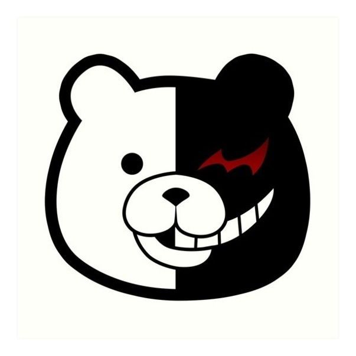

# Monokuma

# Description

Monokuma (モノクマ) is a stuffed robotic bear and the self-proclaimed Headmaster of Hope's Peak Academy who instigates the Killing School Life featured in Danganronpa: Trigger Happy Havoc.

He later takes over the Killing School Trip featured in Danganronpa 2: Goodbye Despair, kicking out Usami in the process.

Monokuma returns once again in the Ultimate Academy for Gifted Juveniles Series, starting a new Killing Game, the Killing School Semester, featured in Danganronpa V3: Killing Harmony alongside his children, the Monokubs.

For mare information access this [link](https://danganronpa.fandom.com/wiki/Monokuma).